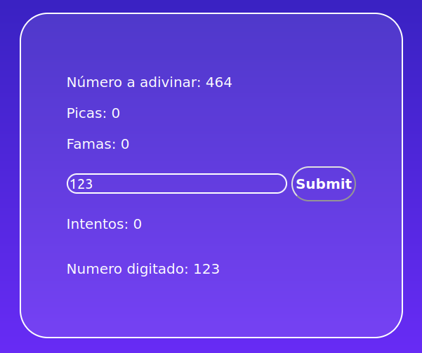

# Heroku Picas y Famas

Aplicación que utiliza la nube de Heroku para desplegar el juego Picas y Famas, el cual consiste en adivinar un número aleatorio, para esto te dan dos ayudas las **picas** que serán iguales al número de dígitos que se encuentran en el número aleatorio, y las **famas** que serán iguales al número de dígitos que coinciden con la posición de los dígitos del número aleatorio.

## Instrucciones de Uso

### Prerrequisitos
* Git versión 2.25.1
* Apache Maven versión: 4.0.0
* java versión: "1.8.0"

### Ejecución
Para poder usar el proyecto lo primero que se debe realizar es clonar el proyecto utilizando el siguiente comando desde una terminal:
```
git clone https://github.com/Desarik98/PicasyFamas.git
```
Luego de clonar el proyecto, por medio de la terminal se debe ejecutar el siguiente comando para poder generar las dependencias necesarias para poder ejecutar el proyecto, para esto es necesario tener instalado **Maven**
```
mvn package
```
A continuación, para ejecutar el programa se debe ejecutar el siguiente comando desde la terminal en el directorio del proyecto clonado
```
java -cp "target/classes:target/dependency/*" edu.escuelaing.arsw.picasyfamas.PicasyFamasApplication
```

## Diagrama de Clases


* **PicasyFamasApplication:** Clase que genera la comunicación con en controlador y la encargada de iniciar la aplicación mediante el uso de Springboot
* **PicasyFamasController** Clase que se encarga de recibir las peticiones y comunicarlas con el modelo (Game)
* **Game:** Clase que se encarga de la lógica del proyecto.

## Pruebas de Usuario Picas y Famas
Para comprobar el funcionamiento se debe ir al link https://picasfamasarsw.herokuapp.com en donde se encontrará el siguiente Home Page:


Al ingresar se deberá ingresar el número de dígitos que desea que la computadora genere aleatoriamente, posteriormente será redirigido al juego en donde tendrá que digitar un número cualquiera y pulsar el botón Submit el cual te dará el número de picas y de famas que tenga el numero digitado.


En el caso en el que el número se haya adivinado se mostrara en pantalla, y habrá un número superior a 0 intentos


En el caso de que no se haya adivinado el número simplemente se mostrará el número en pantalla con un numero de 0 intentos.



## Tecnologias
* Maven
* Java
* Springboot
* Heroku

## Autor
* Daniel Alejandro Mejía Rojas - Fecha: 20/06/2021

## Licencia
This project is licensed under the CC0 1.0 Universal Creative Commons License - see the LICENSE.md file for details
